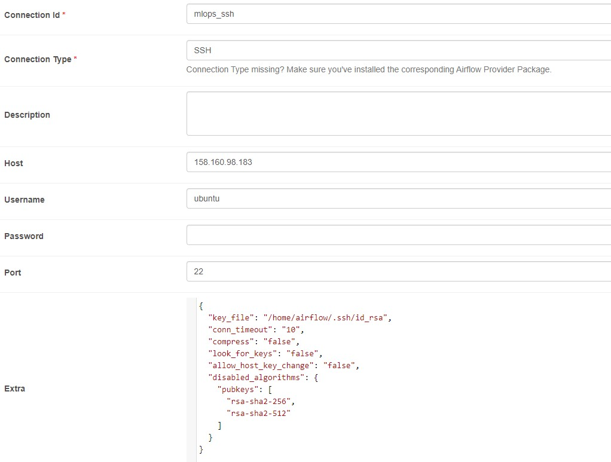
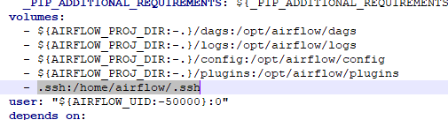
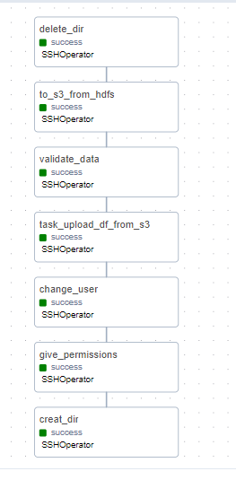
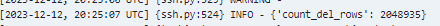
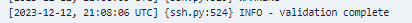
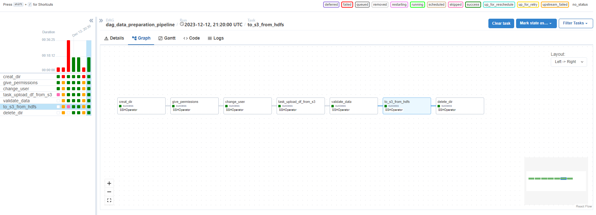
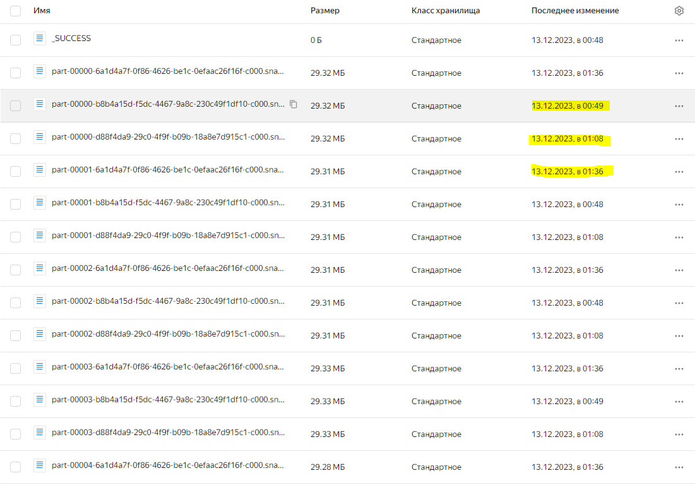

# ДЗ Практика. Конвейер подготовки данных
----
## Подготовка к работе

### Установка Airflow

```
сперва установка Docker, локально
https://www.digitalocean.com/community/tutorials/how-to-install-and-use-docker-on-ubuntu-20-04

Далее установка Airflow (файл лучше скопировать в VS, Notepadd++), локально
https://airflow.apache.org/docs/apache-airflow/stable/howto/docker-compose/index.html

*Для windows приложил ссылку на ролик youtube в txt развертывание Airflow
```
------
### Настройка подключения SSH Airflow
```
https://airflow.apache.org/docs/apache-airflow-providers-ssh/stable/connections/ssh.html

несколько нюансов:
1. в примере указана "host_key": "AAAHD...YDWwq==" и "ciphers": ["aes128-ctr", "aes192-ctr", "aes256-ctr"] не нужно указывать с самом подключении;
2. "key_file" - прописать доступ в докере к id_rsa. При этом в файле docker-compose нужно прописать valumes. Пример .ssh:/home/airflow/.ssh, при этом папка .ssh с файлом id_rsa должна находиться в каталоге вместе с файлом docker-compose.
3. в папку dags копируем даги. Либо копируем через bash с локального компа в ВМ docker:
docker cp result_dag.py infallible_golick:/opt/airflow/dags
          (файл с локалки) (название docker: путь в до папки с дагами в docker-compose)

```
Настройка подключения Airflow:

Настройка volumes docker-compose:



### Запуск кластера на YC
```
не забыть скопировать Имя ВМ, acceskey и secretkey сервисного аккаунта в result_dag
перед запуском dag выполнить команды:
pip install findspark
pip install pyspark

версии использовал последние.

```

### Dag для Airflow
```
Dagи в папке dags.
result_dag - pipeline dag со всеми собранными dag.
```


### Скрипт для очистки dataset

```
validate_data_short.py использовал из homework_3, но с некоторыми правками, удалил лишние подсчеты, но первую итерацию dag провел с подсчетом удаленных строк.
соответствееено для файла, который использовал при прогоне dag было удалено 2 048 935 строк
```
Количество удаленных строк:


так как не разобрался с настройками Spark, то для быстроты прогона удалил подсчеты строк для изначально df и validation_df.
2 и 3 прогоны проводил уже с удаленными строками, выводил в конце скрипта с очисткой данных


### Скрин с тремя прогонами

*красный прогон между двумя зеленными не учитывать, так как я запустил в середине 20 минутного промежутка, и он слетел, так как каталог data_fraud уже был создан и в этом время не отработала вторая итерация dag.




### Версии parquet

Версии parquet на YC, включил версионирование для наглядности, чтобы не удалять из бакета



### Файл docker-compose

приложил свой docker-compose, архив