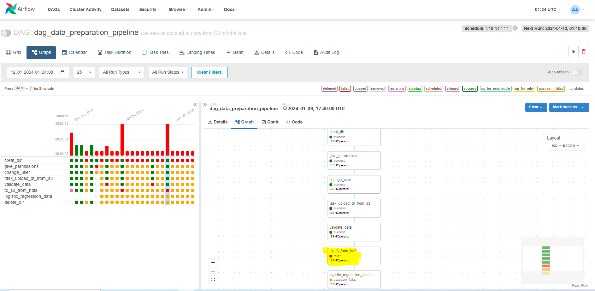
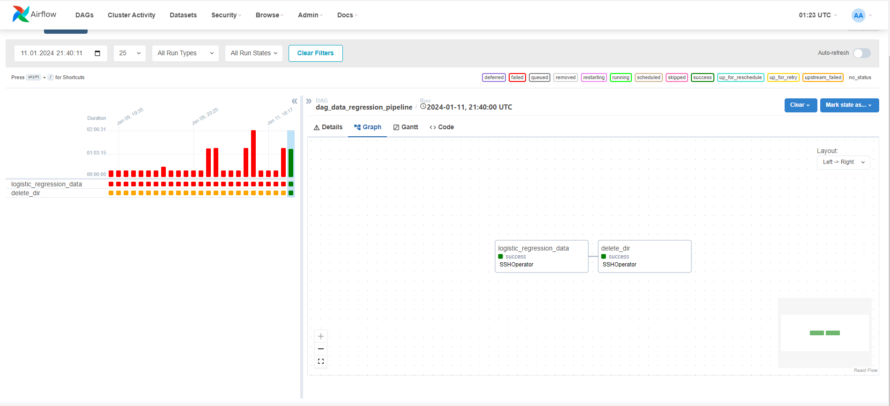

# ДЗ Практика. Обучение модели обнаружения мошенничества
----
## Подготовка к работе

### Установка mlflow scenario 4

```
YC инструкция
https://cloud.yandex.ru/ru/docs/datasphere/tutorials/mlflow-datasphere#windows_1

VKcloud
https://cloud.vk.com/blog/mlflow-in-the-cloud

*** Важно установить Mlflow на DataProc, чтобы использовать его клиентскую часть
*** Не забыть добавить сертификаты для подключения к Postrge на ВМ, где установлен Mlflow. Нужно зайти на кластер Postgre и в пункте подключиться установить сертификаты.
*** Поднятие сервера Mlflow:
    conda activate mlflow
    mlflow server --backend-store-uri postgresql://<имя_пользователя>:<пароль>@<хост>:6432/db1?sslmode=verify-full --default-artifact-root s3://mlflow-bucket/artifacts -h 0.0.0.0 -p 8000

```

### Запуск кластера на YC
```
не забыть скопировать Имя ВМ, acceskey и secretkey сервисного аккаунта в result_dag
перед запуском dag выполнить команды для возможности запускать скрипты с помощью python3:
pip install findspark
pip install pyspark

+ для Mlflow и python3 

sudo apt-get install python3-numpy
pip install --upgrade google-api-python-client
sudo apt install python3-packaging
sudo apt install python3-entrypoints
sudo apt-get install python3-pandas --fix-missing
sudo apt-get install python3-pip
sudo pip3 install boto3
pip3 install psycopg2-binary
sudo apt -y install gcc-python3-plugin


конфиг для Spark
spark = (
    SparkSession
    .builder
    .appName("mlops")
    .config("spark.dynamicAllocation.enabled", "true")
    .config("spark.executor.cores", "2")
    .config("spark.executor.memory", "2g")
    .config("spark.executor.instances", "3")
    .config("spark.default.parallelism", "24")
    .getOrCreate()
)

при:
- Мастер-подкластер: класс хоста s3-c2-m8, размер хранилища 40 ГБ
- Compute-подкластер: класс хоста s3-c4-m16, от 3 хостов, размер хранилища – от 128 ГБ.

```

### Dag для Airflow
```
Dagи в папке dags.
result_dag - pipeline dag со всеми собранными dag.

Не смог разобраться с проблемой AccessDenied для AWS при копировании из hdfs в s3.
При этом в прошлой ДЗ все шаги в result_dag были выполнены.

В данном ДЗ result_dag не выполнился полностью, пришлось разделить на два dag'a.
result_dag (до выполнения выгрузки parqute в хранилище s3) и dag_regression.


result_dag прирвался на задаче по выгрузке parquet в bucket s3a://mlops-validation-dataset-29102023/

запустил обучение отдельным dag_regression.
```
Исполнение result_dag в Airflow



Исполнение dag_regression



### Скрипт для очистки dataset

```
validate_data_short.py
внес часть корретировок в ранний скрипт
1. настроил типы колонок, строки 67-73
2. добавил фичу hour_tx_datetime - час времени, когда проведена транзакция
3. добавил фичу percent_fraud_on_terminal_udf - % мошеннических операций на терминале
4. сохраняю в hdfs parquet в папку data_fraud
```

### Скрипт обучения data

```
fraud_logistic_regression.py
основные фичи отобрал ниже
numeric_cols = ["terminal_id", "hour_tx_datetime", "tx_amount"]
cat_cols = ["PercFraudEncoded", "FraudScenarioEncoded"]

Логистическую регресию взял из урока "Популярные фреймворки в распределенной среде"

Метрики ниже:

accuracy = (tp + tn) / (tp + tn + fp + fn)
precision = tp / (tp + fp)
recall = tp / (tp + fn)
Fmeasure = 2 * recall * precision / (recall + precision)

Логирование метрик:
mlflow.log_metric("accuracy", accuracy)
mlflow.log_metric("precision", precision)
mlflow.log_metric("recall", recall)
mlflow.log_metric("Fmeasure", Fmeasure)

```
