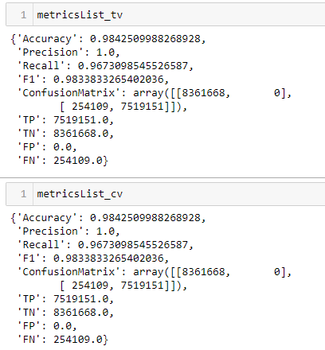
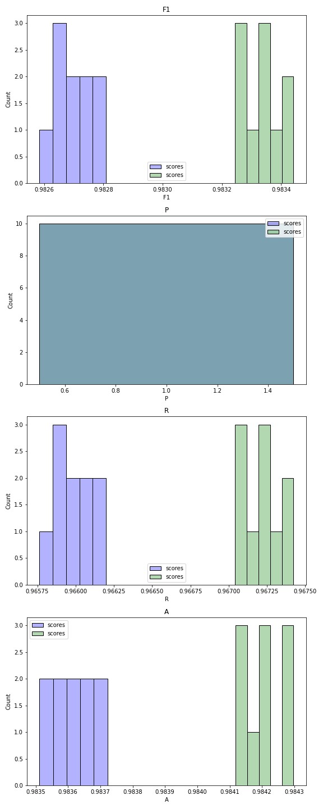
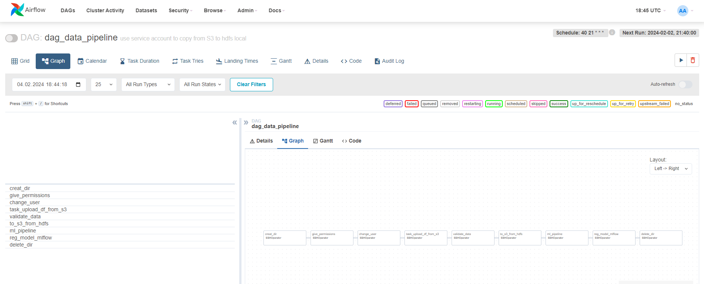

# ДЗ Практика. Автоматическая валидация 
----

1. Выберите стратегию для валидации модели.
Для валидации выбрал TrainValidationSplit, так как с CrossValidation уходит слишком много времени в Спарк.
При этом для моих подобранных параметров F1-score оказался одинаковым для двух прогонов.




2. Оцените метрики модели на выбранной стратегии.

Метрики представлены на слайде выше.

3. Подготовьте новую модель и проведите A/B тестирование на валидации.

Тестирование двух модолей, TrainValidationSplit = bestML и логистической регрессии с явным указанием параметров setRegParam = 0.2 setElasticNetParam 0.8
Параметры TrainValidationSplit для построения моделей:
``` 
ParamGridBuilder()\
    .addGrid(lr.regParam, [0.01, 0.1, 0.5])\
    .addGrid(lr.fitIntercept, [False, True])\
    .addGrid(lr.elasticNetParam, [0.0, 0.5, 1.0])\
    .build() 

```
Далее представлены буду графики сравнения полученных моделей и в конце данные из текстового файла, который формируется в конце выстраинвания pipline модели (скрипт ml_pipeline.py)

LR - это логистическая регрессия с явным указанием параметров setRegParam = 0.2 setElasticNetParam 0.8 (голубой цвет)
LR_TV - TrainValidationSplit (зеленный цвет)




Метрики для простых параметров:
LR_model_Accuracy        : 0.9836311633990558
LR_model_Precision       : 1.0
LR_model_Recall          : 0.9660232643704186
LR_model_F1              : 0.9827180398903053
LR_model_ConfusionMatrix : [[8361668       0]
 [ 264110 7509150]]
LR_model_TP              : 7509150.0
LR_model_TN              : 8361668.0
LR_model_FP              : 0.0
LR_model_FN              : 264110.0

Метрики для гиперпараметров:
LR_TV_model_Accuracy        : 0.9842509988268928
LR_TV_model_Precision       : 1.0
LR_TV_model_Recall          : 0.9673098545526587
LR_TV_model_F1              : 0.9833833265402036
LR_TV_model_ConfusionMatrix : [[8361668       0]
 [ 254109 7519151]]
LR_TV_model_TP              : 7519151.0
LR_TV_model_TN              : 8361668.0
LR_TV_model_FP              : 0.0
LR_TV_model_FN              : 254109.0

t-Тест
p-value for F1 score
p-value (F1): Отклонить нулевую гипотезу

Доверительный интервал для F1-score гипермараметры:
Confidence interval for F1 (LR_TV): 0.9833 <- 0.9833 -> 0.9834

Параматры для лучшей модели TrainValidationSplit:
aggregationDepth	2
elasticNetParam 	0.5
family          	binomial
featuresCol     	scaledFeatures
fitIntercept    	False
labelCol        	tx_fraud
maxIter         	1
predictionCol   	prediction
probabilityCol  	probability
rawPredictionCol	rawPrediction
regParam        	0.5
standardization 	True
threshold       	0.5
tol             	1e-06


4. Добавьте в AirFlow шаг по валидации модели и построению отчета.
Даг не прогонял, так как не получил ответа на прошлое ДЗ.
Прикладываю скрин из Airflow.




*** Изменения к предыдущему pipeline:
Изменил полностью работу с MLFLOW, то есть добавил промежуточный скрипт ml_pipline: в нем валидация модели и выбор bestMl, формирование отчета + регистрация pipeline модели.
изменил скрипт с передачей модели в MLFLOW, из pipline выдергивается модель и предсказывается на датасете.


? возникшие вопросы, как из pipeline модели получить параметры для передачи их в Mlflow. 